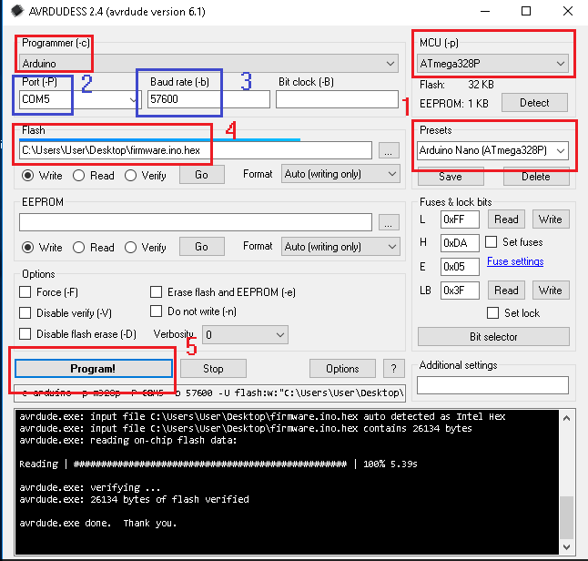

# CreepBot
CreepBot - Mini Quadruped Robot For [ROS](https://ros.org/) Programming Workshops

## Introduction

## Firmware

Download [AVRDUDESS](https://blog.zakkemble.net/avrdudess-a-gui-for-avrdude/) to upload firmware

## Components
<ol>
  <li>HuaDuino - Arduino Nano Compatible Board with Lithium Battery Power Up & Charging DIY</li>
  <li>8 x MG90s Servo</li>
  <li>HC-SR04 Ultrasonic sesnor</li>
  <li>HC-04/05 SPP Bluetooth module or compatibles, set baud rate to 38400
  <li>CC2541 Bluetooth LE module (optional)</li>
  <li>Buzzer</li>
  <li>18650 lithium battery</li>
  <li>Some M2x6/M2x10 tapping screws</li>
</ol>
